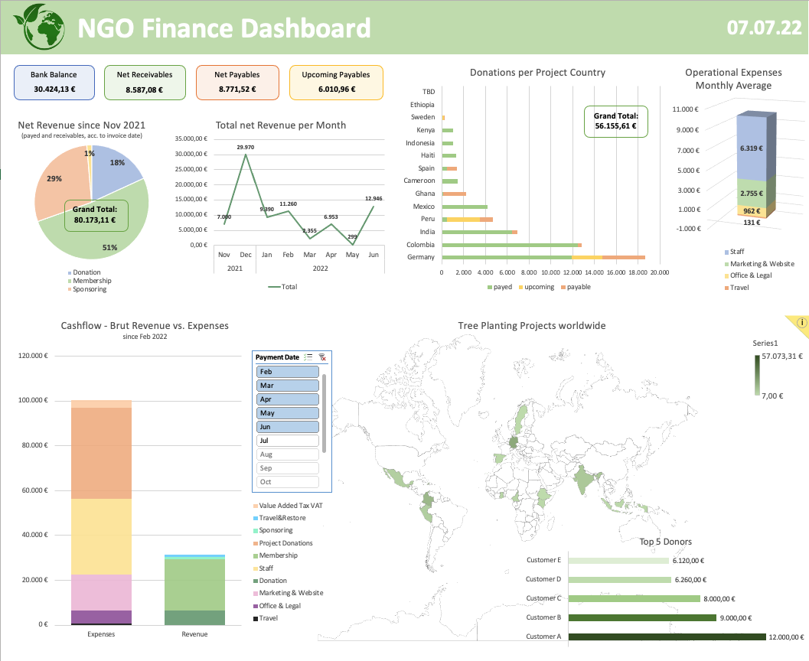

# Interactive Finance Dashboard for a newly founded NGO

Helped a friend to get an financial overview of her young company and help with investor reporting.

Created an interactive Excel dashboard that can easily be updated.

The raw data is derived from the accounting software SevDesk, where bank transactions and invoices can be booked to payment accounts.

This is what it looks like:

